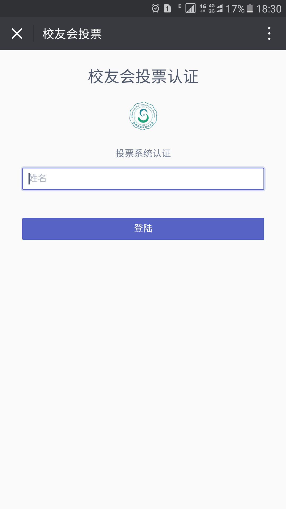

# 校友会投票程序 

校友会投票程序

## 总结

基于Laravel和Vue 2.0开发

### 开发目的
```
应深圳技师学院校友会成立大会暨首届校友代表大会第一次会议需求，需在无记名投票过程中进行无记名网络选举，因此，邀请我们极客工作室进行投票软件开发，应用于现场的无记名投票工作。

```

### 设计、思考阶段
```
因为是无记名投票，所以我们只记录票数，并不统计投票对象。
应投票系统负责人要求，只有一次投票机会，即投完后不能进行更改。
投票系统登陆设计中，原本打算进行身份证认证登陆，但考虑到收集信息麻烦以及身份证信息私密性，即修改为姓名认证登陆。
由于是姓名登陆，所以在后台系统中，我们需要有功能去取消投票人投票记录，以防其余人员冒充投票。


```

### 开发过程
#### 确认技术栈
```
轻量前端框架 Spectre.css
渐进式JavaScript框架 Vue.js
Http库 Axios
简介优雅php框架 Laravel

```
#### 数据库设计
```
admin -> 用于投票系统开启判定
bevote -> 被投票人信息记录
user -> 投票人信息记录
history -> 投票历史纪录

```

#### 遇到问题
```
419 错误代码 -> 
在真机测试中，发生419错误代码提示，查明原因说是token过期，但是电脑访问没有出现问题。
经测试，是在php内置服务器中运行中有问题，放到apache目录下即解决。原因暂未查明。

php 压力测试 -> 
在本地压力测试过程中，出现程序崩溃状。
经查明，是windows下apache默认并发数不够大，以及php内存设置不足，调大参数即可。

```

#### 总结
```
因为是真实项目的开发，所以要把问题想的更全面一点，确保系统在现场运行无误。即使是只使用一次，也要尽可能的做到最好，这也是个人成长中不可多得的一部分。希望有机会能继续完善程序，慢慢打磨。

```

## 现场

校友会圆满结束，程序在现场投票中顺利运行。



